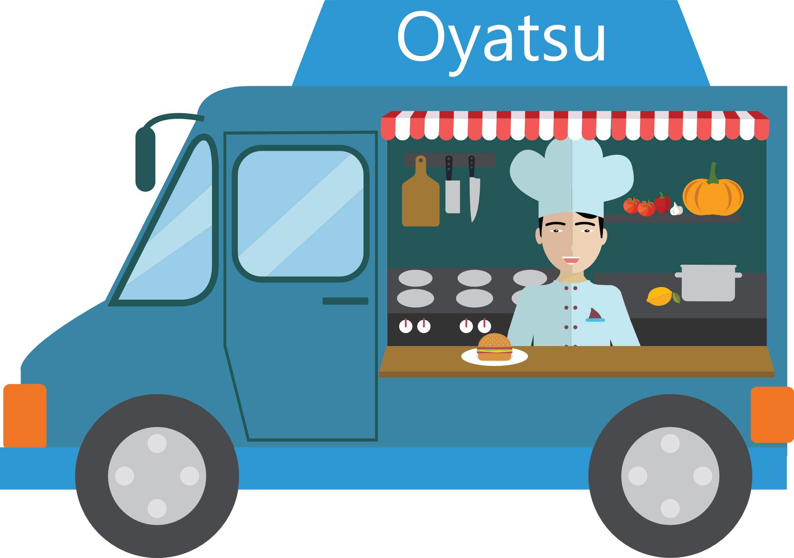

# 🍔 Oyatsu

<div align="center">
   
</div>

---
**Oyatsu** é um sistema para gerenciamento de pedidos para lanchonetes. O nome "Oyatsu" (おやつ) significa "lanche" em japonês, representando a proposta do sistema de tornar o processo de pedidos tão simples e agradável quanto desfrutar de um bom lanche.

## 📋 Sobre o Projeto

Oyatsu foi desenvolvido para facilitar a gestão de pedidos em lanchonetes, oferecendo uma interface intuitiva tanto para os funcionários quanto para os clientes. O sistema permite:

- Cadastro e gestão de produtos (lanches, bebidas, combos, etc.)
- Registro de pedidos
- Controle de caixa e pagamentos

## 🚀 Tecnologias Utilizadas

-  - 81.5% - Backend e lógica de negócios
-  - 10.1% - Queries e gerenciamento de banco de dados
-  - 7.4% - Estilização da interface
-  - 1.0% - Extensões específicas

## 🛠️ Instalação e Configuração

### Pré-requisitos
- WAMP ou XAMPP (PHP 7.0 ou superior)
- Servidor SQL

### Passos para instalação

1. Clone o repositório:
```bash
git clone https://github.com/YujiSeto/Oyatsu.git
```

2. Inicie seu servidor WAMP ou XAMPP

3. Configure o banco de dados:
   - Abra o phpMyAdmin
   - Crie um novo banco de dados chamado "oyatsu"
   - Importe o arquivo `Oyatsu/Assets/oyatsu.sql`

4. Mova os arquivos do projeto para a pasta do seu servidor web (geralmente `www` ou `htdocs`)

5. Acesse o sistema pelo navegador:
```
http://localhost/Oyatsu/
```

## 📱 Recursos e Funcionalidades

### Gerenciamento de Produtos
- Cadastro de categorias de produtos (lanches, porções, bebidas, sobremesas)
- Adição/remoção/edição de itens do cardápio
- Configuração de preços e disponibilidade

### Gestão Financeira
- Relatórios básicos de vendas
- Histórico de transações

## 📊 Modelo de Dados

O sistema utiliza um modelo relacional com as seguintes entidades principais:
- **Produtos**: Itens disponíveis no cardápio (lanches, bebidas, etc.)
- **Categorias**: Classificação dos produtos
- **Pedidos**: Registros de compras dos clientes
- **Itens de Pedido**: Produtos específicos em cada pedido
- **Usuários**: Funcionários com acesso ao sistema
- **Formas de Pagamento**: Métodos de pagamento aceitos

## 👥 Contribuição

Contribuições são bem-vindas! Se você deseja contribuir:

1. Faça um Fork do projeto
2. Crie uma Branch para sua feature (`git checkout -b feature/AmazingFeature`)
3. Commit suas mudanças (`git commit -m 'Add some AmazingFeature'`)
4. Push para a Branch (`git push origin feature/AmazingFeature`)
5. Abra um Pull Request

## 📞 Contato

Yuji Seto - [GitHub](https://github.com/YujiSeto)

Link do projeto: [https://github.com/YujiSeto/Oyatsu](https://github.com/YujiSeto/Oyatsu)

---

Feito com ❤️ para facilitar o gerenciamento de lanchonetes.
